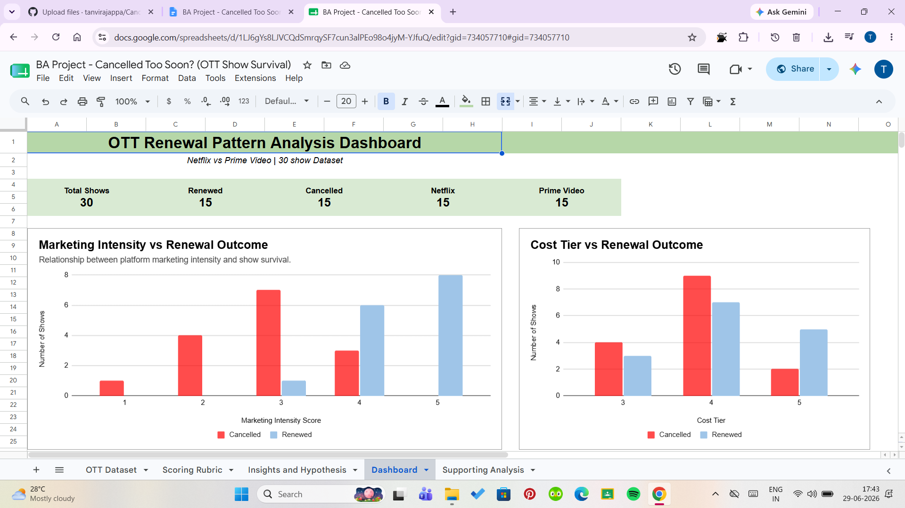
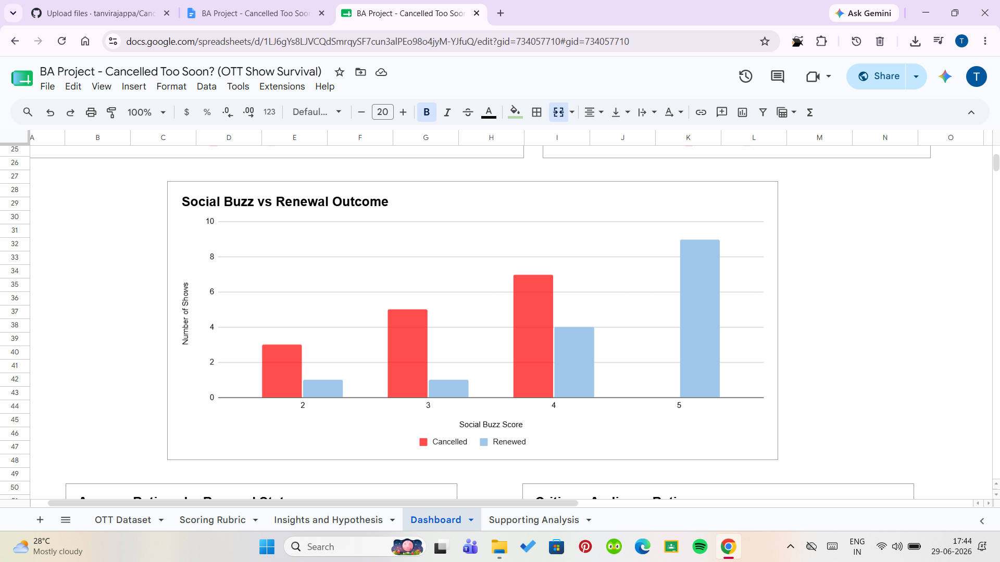
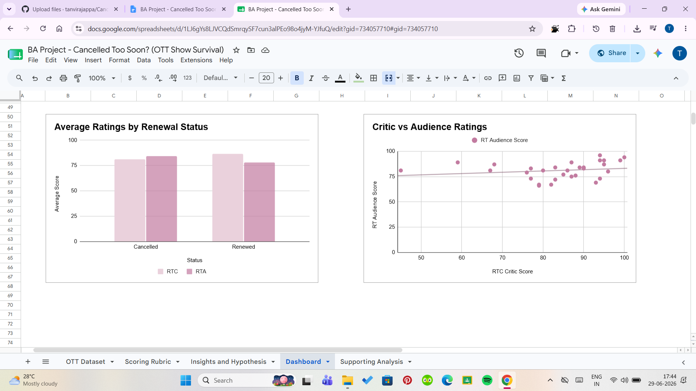

# 🎬 Cancelled Too Soon?
## A Business Analytics Study on OTT Content Survival

### 📌 Project Overview

Streaming platforms invest millions of dollars into original content, yet many highly rated shows are still cancelled. This project investigates whether publicly observable factors can help explain OTT content renewal decisions.

Using a curated dataset of Netflix and Amazon Prime shows, this analysis explores how audience reception, marketing intensity, social engagement, production scale, genre complexity, and platform-related factors interact with renewal outcomes. The project concludes with strategic recommendations that could improve content performance and renewal success.

---

## Business Objective

To analyze the factors influencing whether streaming shows are renewed or cancelled, explore whether renewal outcomes can be predicted using publicly observable indicators, and provide strategic recommendations to improve content performance and decision-making.

---

## Live Project

The original Google Sheets workbook can be viewed here:

🔗 [View the project](https://docs.google.com/spreadsheets/d/1LJ6gYs8LJVCQdSmrqySF7cun3alPEo98o4jyM-YJfuQ/edit?usp=sharing)

## Dataset

- 30 OTT shows
- Platforms:
  - Netflix
  - Amazon Prime Video
- Variables analyzed include:
  - IMDb Rating
  - Rotten Tomatoes Critic Score
  - Rotten Tomatoes Audience Score
  - Genre
  - Number of Seasons
  - Number of Episodes
  - Release Year
  - Marketing Intensity
  - Social Buzz
  - Fan Campaign Presence
  - Production Cost Tier
  - Renewal Status

---

## 📊 Dashboard Highlights

### Dashboard 1

### Dashboard 2

### Dashboard 3

---

## Methodology

The project followed a structured Business Analytics approach:

- Data collection and organization
- Creation of a standardized scoring rubric for qualitative variables
- Exploratory Data Analysis (EDA)
- Pattern identification
- Hypothesis development and refinement
- Dashboard creation
- Supporting analyses
- Business recommendations based on findings

A custom scoring framework was developed using publicly observable indicators such as marketing intensity, online engagement, genre complexity, and production scale to maintain consistency across all shows.

---

## Key Findings

- Strong ratings alone did not guarantee renewal.
- Marketing intensity showed a noticeable relationship with renewal outcomes.
- Audience awareness and social buzz appeared to improve survival chances.
- High-production fantasy and science-fiction shows often faced greater renewal pressure.
- Renewal decisions were influenced by multiple interacting factors rather than a single performance metric.

---

## 💡 Strategic Recommendations

Based on the analysis, recommendations were proposed for OTT platforms to improve renewal outcomes by:

- Increasing marketing visibility for promising shows
- Leveraging audience engagement before renewal decisions
- Evaluating production costs alongside audience demand
- Incorporating multiple performance indicators instead of relying on ratings alone
- Using data-driven decision frameworks for future content investments

---

## Repository Contents

- OTT analysis dataset
- Business Analytics dashboard
- Scoring rubric
- Hypothesis testing and insights
- Supporting analysis

---

## Tools Used

- Google Sheets
- Data Cleaning
- Data Visualization
- Dashboard Design
- Exploratory Data Analysis (EDA)
- Business Analytics

---

## Future Improvements

- Expand the dataset with additional OTT platforms.
- Develop predictive models using Python or R.
- Build an interactive Power BI or Tableau dashboard.
- Incorporate streaming viewership and financial metrics if available.

---

**Author:** 
Tanvi Rajappa
